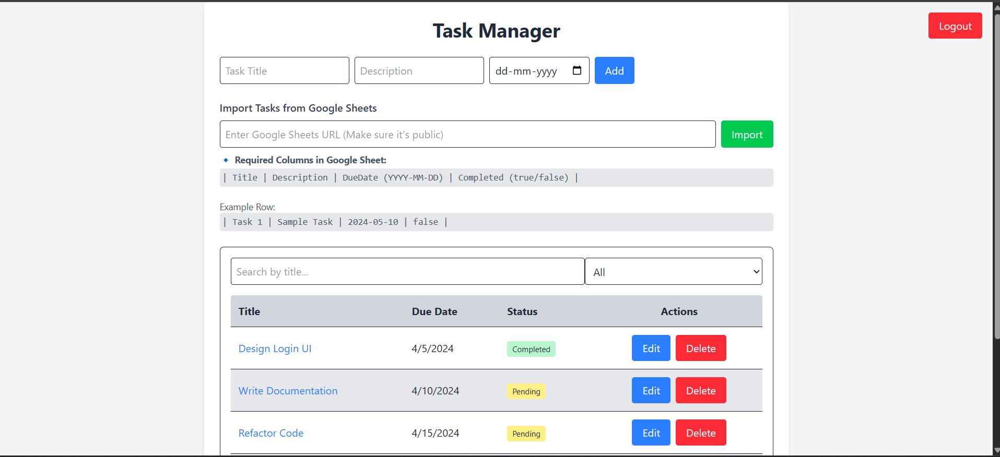
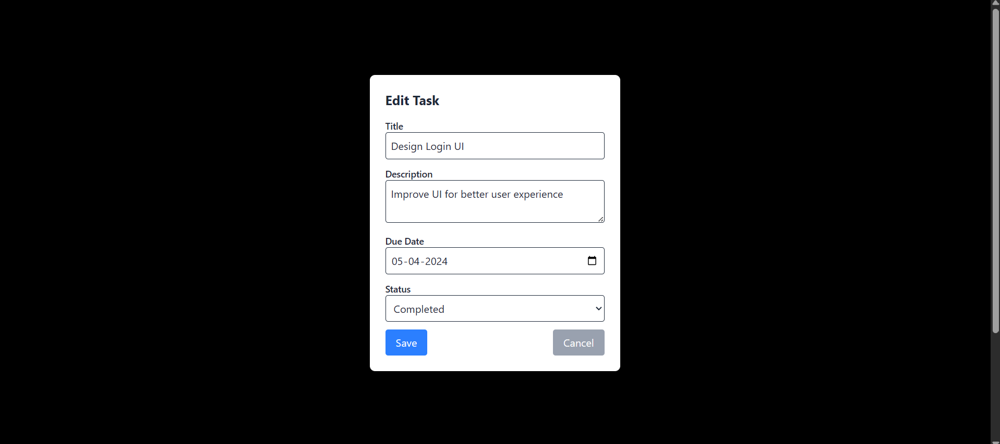
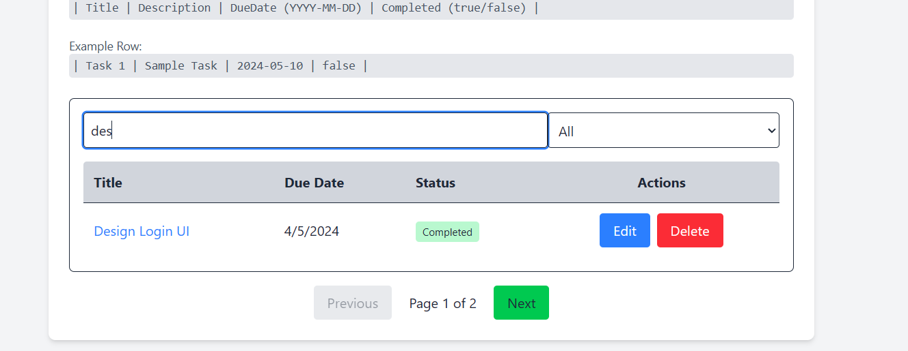
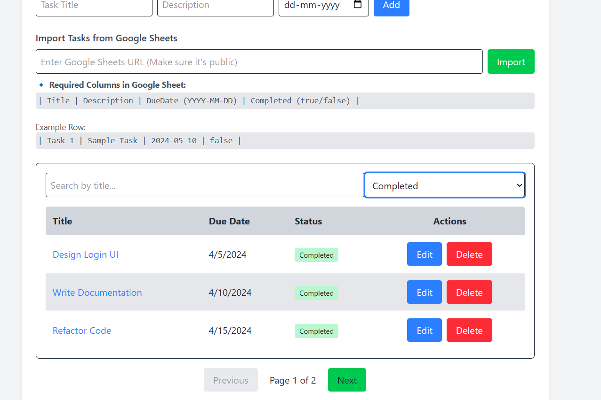
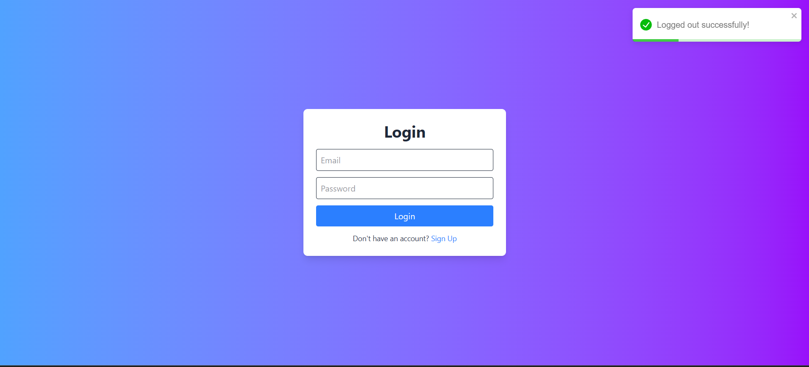
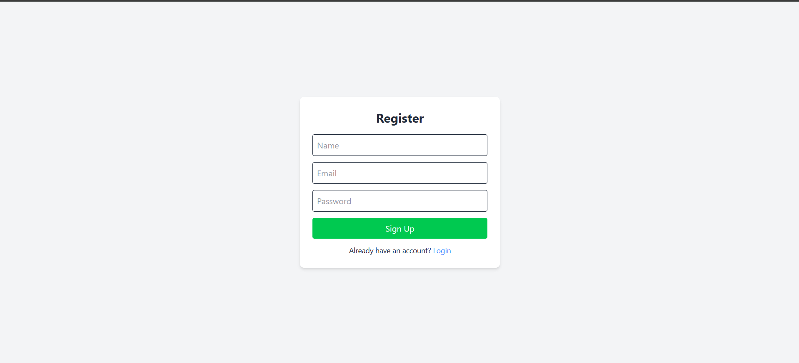
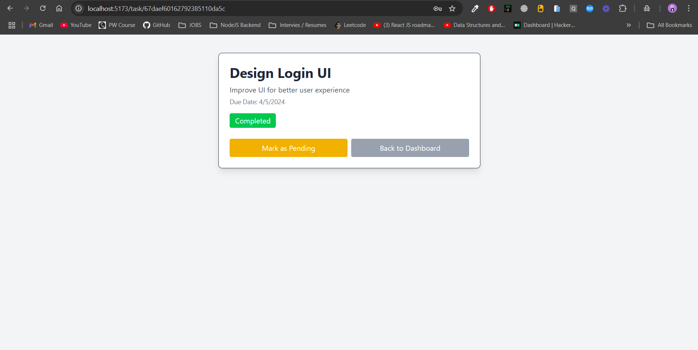
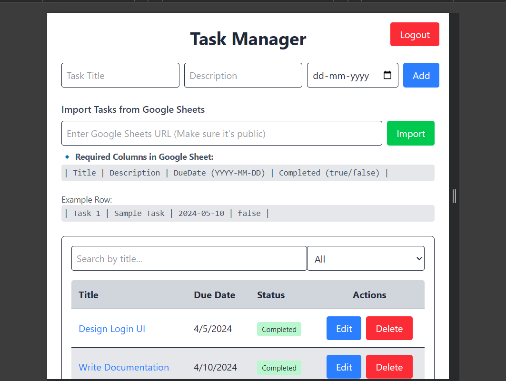

# 📌 Task Manager Frontend

This is the **frontend** for the Task Manager app, built using **React (Vite), Tailwind CSS, and Axios**. It provides a modern UI for **managing tasks, importing from Google Sheets, and user authentication**.

## Output Video and Images

## Video Demo: [Task Manager Frontend](https://www.loom.com/share/bf802c911ecf428e81eb0fb648eda639?sid=e6de4663-1fbb-48e9-910a-7a4227d6d464)

Images: <details><summary>Click to expand</summary>

### 🌐 Live Demo



### Edit Task



### Search and Pagination



### Filter Functionality



### Login Page



### Signup Page



### Task Details Page



### Responsive Design



</details>

## 🚀 Features

✅ **User Authentication (Login / Signup with JWT)**  
✅ **Task Management (Create, Edit, Delete, Complete Tasks)**  
✅ **Google Sheets Import (Public Link Support)**  
✅ **Pagination, Search, and Filtering**  
✅ **Toaster Notifications (Success / Error Messages)**  
✅ **Modern UI with Tailwind CSS**

---

## 📦 Tech Stack

- **React (Vite)** (Frontend Framework)
- **Tailwind CSS** (Styling)
- **Axios** (API Calls)
- **React Router DOM** (Navigation)
- **React-Toastify** (Notifications)

---

## ⚡ Installation & Setup

### 1️⃣ Clone the Repository

```sh
git clone https://github.com/vaibhav-chittora/Clikd-Google-Sheets-Import-Frontend.git

cd task-manager-frontend
```

### 2️⃣ Install Dependencies

```sh
npm install
```

### 3️⃣ Set Up Environment Variables

Create a **.env** file in the root folder and add the following:

```env
VITE_API_BASE_URL=http://localhost:3000
```

### 4️⃣ Start the Frontend

```sh
npm run dev
```

The frontend will be running at **http://localhost:5173** 🚀

---

## 🔗 Main Functionalities

### **Authentication Pages** 🔐

- `/` → Login Page
- `/register` → Signup Page

### **Dashboard (Main Features)** 📌

| Feature          | Description                                     |
| ---------------- | ----------------------------------------------- |
| Task List        | View all tasks (Paginated)                      |
| Add Task         | Create new tasks manually                       |
| Edit Task        | Update title, description, due date, and status |
| Delete Task      | Remove tasks permanently                        |
| Mark as Complete | Toggle task completion status                   |
| Search & Filter  | Search tasks by title, filter by status         |
| Import Tasks     | Fetch structured task data from Google Sheets   |

---

## 🛠️ Additional Info

- **Ensure backend is running before using frontend** ✅
- **Use a valid Google Sheets Public Link for imports** ✅
- **JWT token is stored in LocalStorage for authentication** ✅
